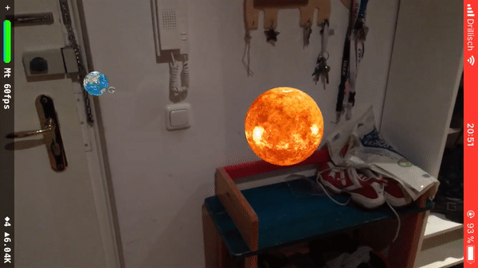

# ARSolarSystem
A simulation of the solar system in ARKit using the Earth, Moon and Sun.
I wrote a [few words](https://nagam11.github.io/nagam11.github.io/Solar-System-ARKit/) about this project in my blog.

Fast rotation and slow rotation version

## Features
* ARKit with SceneKit for the astronomical objects.
* Tap on one object to change the rotation speed.

