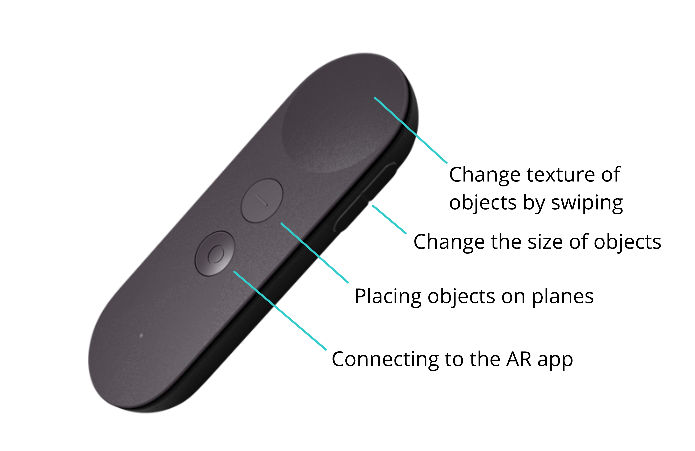
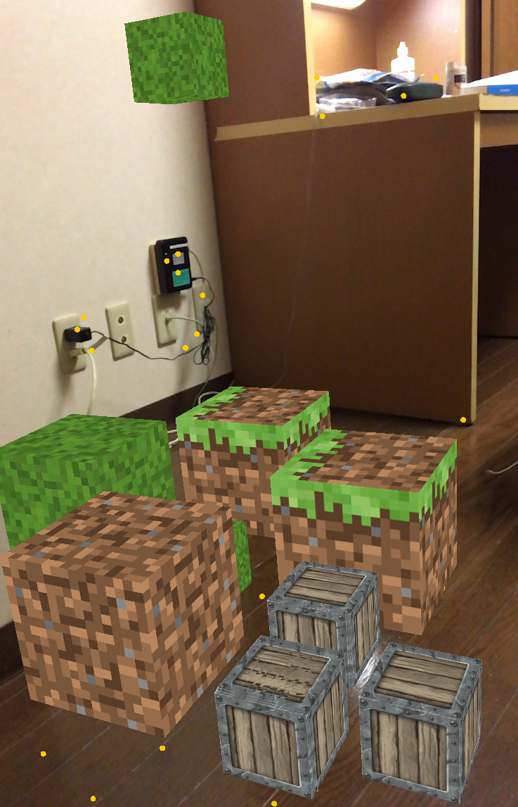
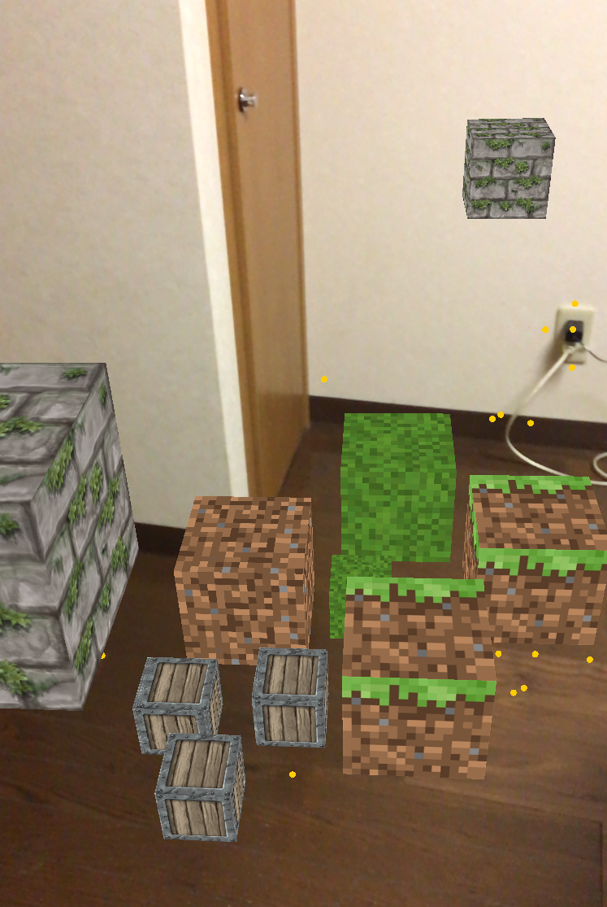

# AR Minecraft

This project is a Minecraft-like game where you can create blocks and build your own structures using ARKit. The main objective of the project is to show how you can use a VR Controller to interact with the augmented world. The controller I use in this case, is a Daydream VR Controller for Gear VR. This device does not offer support for the iOS platform but with the help of this amazing [project](https://github.com/gizmosachin/Daydream), we are able to leverage the controls and touchpad of the device.

  

 

